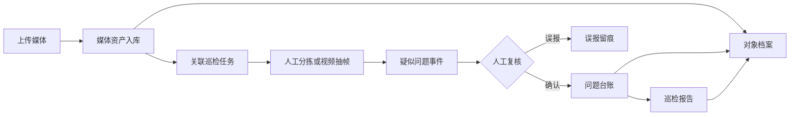

# 巡检宝真实业务闭环设计规格

**日期：** 2026-07-10  
**状态：** 已确认，等待实施  
**适用范围：** 曲阳路街道巡检宝管理端、API、数据库和本地文件存储

## 1. 目标

把巡检宝从“部分真实接口与大量演示交互混合”的原型，升级为可验证、可持久化、可追溯的业务系统。

第一阶段必须完成以下真实闭环：

1. 上传图片、ZIP、MP4 或 MOV 文件。
2. 文件作为媒体资产保存到服务器并写入数据库。
3. 媒体资产关联一次巡检任务和一个管理对象。
4. 操作人员对媒体进行人工分拣；视频可执行后台抽帧。
5. 操作人员通过图片标注创建疑似问题事件，后续 AI 也使用同一事件结构。
6. 疑似事件经过人工复核，确认后生成唯一问题台账记录，误报保留复核痕迹。
7. 已确认问题可进入报告编写，报告草稿、图片、标注和说明保存到服务器。
8. 报告提交后同步显示在报告管理和对应的小区、道路或重点点位档案中。
9. 用户可以从档案追溯到问题、报告、证据图片、视频时间点和原始媒体。

## 2. 本阶段不做

- 不接入正式 YOLO 模型，不把静态样例包装成 AI 识别结果。
- 不做无人机实时直播或实时报警。
- 不做自动派单、短信提醒或执法文书生成。
- 不做多租户复杂权限。
- 不在本阶段全面重做已经定型的首页和档案视觉样式。
- 不立即切换生产数据库或腾讯云 COS，但文件存储必须通过统一接口封装，为后续替换预留边界。

## 3. 设计原则

### 3.1 真实状态优先

- 页面不得在 API 失败时静默显示样例数据。
- 未实现的功能必须显示“暂未开放”，不得弹出“已成功”提示。
- 用户完成的写操作必须经过服务端响应并可在刷新页面后恢复。
- 所有状态数字来自数据库查询或可重算关系，不再使用人为增加的展示数字。

### 3.2 模块锁定

每个模块独立开发、测试、提交 Git。模块验收后，后续模块只使用其公开接口，不重做已验收模块，除非出现阻断性缺陷。

### 3.3 可追溯

问题和报告必须能够追溯到：

- 管理对象；
- 巡检任务；
- 原始媒体；
- 视频时间点或图片序号；
- 标注信息；
- 创建方式；
- 复核人和复核结果。

## 4. 总体流程

## 5. 核心模块

### 5.1 媒体资产

负责接收、校验、保存和查询媒体文件。媒体资产是图片、视频、ZIP 解包结果和视频抽帧图片的统一底座。

媒体资产保存：

- 原始文件名；
- 服务端对象键；
- MIME 类型；
- 文件大小；
- SHA-256；
- 来源类型；
- 上传批次；
- 拍摄时间；
- 经纬度；
- 宽高或视频时长；
- 父媒体，例如抽帧图片所属视频；
- 处理状态和错误原因。

开发环境继续使用本地文件存储，但业务代码只依赖 `MediaStorage` 接口。后续腾讯云部署可实现 `CosMediaStorage`，数据库记录不受影响。

### 5.2 巡检任务

一次巡检任务用于组织同一批次的媒体、管理对象、执行时间和处理结果。

任务状态：

- `draft`：草稿；
- `ready`：媒体上传完成，可开始处理；
- `processing`：正在抽帧或整理；
- `review_pending`：存在待复核事件；
- `completed`：复核完成；
- `failed`：处理失败，可重试。

一个任务可以关联一个主要管理对象，并允许任务内媒体单独改派给其他管理对象。

### 5.3 分拣与抽帧

图片和 ZIP 解包图片支持批量选择后绑定小区、道路或重点点位。

视频支持后台抽帧：

- 默认每 3 秒抽取一帧；
- 允许在 2 至 5 秒之间调整；
- 抽帧图片作为子媒体资产保存；
- 记录视频时间点；
- 任务失败时保存可读错误原因；
- 重试不得重复创建相同帧记录。

第一阶段使用人工查看和标注生成事件。事件来源明确记录为 `manual`，避免伪装成 AI 结果。

### 5.4 疑似事件与复核

疑似事件包含：

- 问题类型；
- 标题和描述；
- 所属任务；
- 所属管理对象；
- 来源方式 `manual` 或 `ai`；
- 视频起止时间；
- 严重程度；
- 置信度，人工事件为空；
- 证据媒体；
- 图片标注；
- 复核状态。

复核状态：

- `pending`：待复核；
- `confirmed`：已确认；
- `false_positive`：误报；
- `returned`：退回补充。

确认事件时，后端在一个事务中完成：

1. 写入复核记录；
2. 创建问题台账；
3. 关联事件证据；
4. 更新任务状态和对象统计；
5. 写入审计日志。

同一事件只能创建一个问题。重复确认返回已有问题，不重复写入。

### 5.5 报告编写

报告编写不再使用浏览器 `localStorage` 作为正式存储。

报告支持：

- 新建和自动保存草稿；
- 选择已确认问题；
- 添加媒体和证据；
- 保存每张图片对应的说明；
- 保存矩形、箭头和文字标注；
- 暂存并切换下一张图片；
- 提交报告；
- 在报告管理重新打开；
- 下载服务器生成的报告文件。

提交报告后，报告与问题、媒体和管理对象的关系必须全部持久化。

### 5.6 对象档案

小区、道路和重点点位继续共用统一档案工作台，但读取真实接口：

- 基础信息；
- 关联巡检任务；
- 关联媒体；
- 问题清单和状态；
- 巡检报告；
- 处置时间线。

基础信息编辑必须调用后端；媒体推送必须创建真实关联记录；删除采用二次确认和软删除，不直接物理删除历史档案。

## 6. 数据模型

现有模型保留，并新增或扩展以下实体。

### 6.1 新增实体

#### `MediaAsset`

统一记录原始图片、视频、ZIP、解包图片、抽帧图片和标注结果。

关键字段：`id`、`kind`、`sourceType`、`originalFileName`、`storageKey`、`mimeType`、`fileSize`、`sha256`、`status`、`capturedAt`、`longitude`、`latitude`、`width`、`height`、`durationMs`、`parentMediaId`、`videoTimestampMs`、`errorMessage`、`createdAt`。

#### `InspectionTask`

关键字段：`id`、`name`、`taskType`、`status`、`primaryObjectId`、`inspectionDate`、`frameIntervalSeconds`、`createdBy`、`createdAt`、`updatedAt`。

#### `InspectionTaskMedia`

连接巡检任务和媒体，字段包括 `taskId`、`mediaId`、`assignedObjectId`、`sortOrder`。

#### `AnalysisEvent`

关键字段：`id`、`taskId`、`objectId`、`sourceType`、`category`、`title`、`description`、`severity`、`confidence`、`startTimeMs`、`endTimeMs`、`reviewStatus`、`issueId`、`createdAt`、`updatedAt`。

#### `EventEvidence`

连接事件与媒体，保存 `eventId`、`mediaId`、`isPrimary`、`sortOrder`。

#### `EventReview`

保存 `eventId`、`reviewer`、`result`、`remark`、`createdAt`。

#### `MediaAnnotation`

保存 `mediaId`、`eventId` 或 `reportId`、`shapeType`、标准化坐标、颜色、线宽、文字内容和层级。

#### `ReportIssue`

连接报告与问题，避免继续使用不可追溯的 `issueCount` 人工数值。

#### `ReportMedia`

连接报告与媒体，并保存排序和图片说明。

#### `ManagedObjectMedia`

连接档案与媒体，记录关联来源和关联时间。

### 6.2 扩展现有实体

- `ManagedObject`：增加 `parentId`、基础信息字段、软删除字段。
- `Issue`：增加 `description`、位置、经纬度、来源事件、处理建议和状态历史关系。
- `InspectionReport`：增加草稿状态、提交人、提交时间、巡检任务关系和版本号。
- `AuditLog`：记录真实用户、请求 ID、结果和失败原因。

### 6.3 统计规则

- `issueCount`、`reportCount` 和首页指标由关系查询或事务内维护，必须可重算。
- 迁移时重新计算现有对象统计，不沿用不一致缓存值。
- 新增一致性检查命令，能够报告对象计数、报告关联和文件引用差异。

## 7. API 边界

### 7.1 媒体与任务

- `POST /api/v1/media/upload`
- `POST /api/v1/media/import-zip`
- `GET /api/v1/media`
- `GET /api/v1/media/:id`
- `GET /api/v1/media/:id/file`
- `POST /api/v1/inspection-tasks`
- `GET /api/v1/inspection-tasks`
- `GET /api/v1/inspection-tasks/:id`
- `POST /api/v1/inspection-tasks/:id/media`
- `PATCH /api/v1/inspection-tasks/:id/media/:mediaId/assignment`
- `POST /api/v1/inspection-tasks/:id/extract-frames`

### 7.2 事件与复核

- `POST /api/v1/analysis-events`
- `GET /api/v1/analysis-events`
- `GET /api/v1/analysis-events/:id`
- `PATCH /api/v1/analysis-events/:id`
- `POST /api/v1/analysis-events/:id/reviews`

### 7.3 报告与档案

- `POST /api/v1/reports/drafts`
- `PATCH /api/v1/reports/:id`
- `POST /api/v1/reports/:id/media`
- `POST /api/v1/reports/:id/issues`
- `POST /api/v1/reports/:id/submit`
- `GET /api/v1/reports/:id/export`
- `PATCH /api/v1/managed-objects/:id`
- `DELETE /api/v1/managed-objects/:id`
- `GET /api/v1/managed-objects/:id/media`
- `GET /api/v1/managed-objects/:id/timeline`

写接口必须校验 DTO，并统一返回 `400`、`401`、`404`、`409` 和 `422` 的可读错误信息。

## 8. 前端页面调整

### 8.1 媒体库

保留现有总体视觉方向，改造成真实工作区：

- 顶部上传与创建任务；
- 左侧来源与待分拣队列；
- 中间媒体或任务列表；
- 右侧真实详情和对象分配；
- 明确显示上传、处理、失败、待分拣和已归档状态。

### 8.2 复核工作区

在媒体库内进入任务复核界面：视频帧/图片、标注、事件信息、对象关联和确认操作集中处理。确认后显示真实问题编号及跳转入口。

### 8.3 报告编写

复用现有标注画布的交互成果，替换本地数据层。工具栏行为、图片切换和说明暂存必须真实可恢复。

### 8.4 档案工作台

保留现有页面结构，移除固定 KPI、固定问题照片和伪造时间线，接入真实媒体、问题和报告关系。

## 9. 错误处理

- API 加载失败显示错误态和重试按钮，不显示样例数据。
- 401 清除会话并跳转登录。
- 上传校验文件扩展名、文件头、大小和 ZIP 路径，拒绝危险文件。
- ZIP 限制解包文件数量和解压后总大小，阻止路径穿越和压缩炸弹。
- 文件写入成功但数据库失败时删除文件；数据库成功但后续任务失败时保留资产并标记失败。
- 抽帧任务支持幂等重试。
- 复核和报告提交使用幂等键或唯一约束，阻止重复问题和重复报告。
- 用户离开未保存页面前显示明确提示。

## 10. 测试策略

每个模块必须包含：

- 数据模型约束测试；
- 服务层单元测试；
- API 集成测试；
- 前端组件或状态测试；
- 一条浏览器关键流程测试；
- TypeScript 类型检查；
- 前后端生产构建检查。

最终端到端验收用例：

1. 上传包含图片和视频的巡检批次。
2. 创建任务并关联曲阳路。
3. 对视频执行抽帧。
4. 从一张证据图片创建人工疑似事件。
5. 确认事件并生成问题。
6. 把问题加入报告，保存标注和说明。
7. 提交并下载报告。
8. 在曲阳路档案中看到媒体、问题和报告。
9. 从问题追溯到任务、视频时间点和原始视频。
10. 重启服务后所有数据仍存在。

## 11. 模块与验收边界

### 模块 1：工程和 Git 基线

- 当前工作区通过类型检查和生产构建。
- 保存当前未提交成果为可回退检查点。
- 建立前后端测试入口和最小冒烟测试。
- 修复 API 监听、健康检查和生产密钥校验。
- API 失败不再被样例数据掩盖。

### 模块 2：媒体资产与任务

- 真实上传图片、ZIP、MP4 和 MOV。
- 文件、哈希、元数据、任务和对象关联持久化。
- 刷新页面和重启服务后可恢复。
- 非法文件得到明确错误。

### 模块 3：分拣、抽帧与人工事件

- 媒体支持批量改派对象。
- 视频真实抽帧并保存时间点。
- 人工标注创建真实疑似事件。
- 失败任务可查看原因和重试。

### 模块 4：复核与问题台账

- 确认、误报和退回真实持久化。
- 确认事件事务性创建唯一问题。
- 问题详情可追溯原始媒体、任务和标注。

### 模块 5：报告持久化

- 草稿、图片说明和标注保存到服务器。
- 提交后出现在报告管理中并可重新打开。
- 报告可以下载，且关联问题和证据。

### 模块 6：档案真实关联

- 档案基础信息可编辑并持久化。
- 问题、报告、媒体和时间线均来自真实关系。
- 所有统计和数据库关系一致。
- 完整闭环通过浏览器验收。

## 12. Git 交付规则

- 新建 `codex/real-workflow-v1` 分支。
- 先为当前工作区创建经过验证的基线提交。
- 每个模块至少一个独立提交，提交前运行本模块测试和全局类型检查。
- 模块提交后不混入下一模块的修改。
- 每个模块完成后记录到 `docs/开发阶段记录.md`。
- 推送远端前检查提交内容，不提交数据库文件、上传媒体、密钥和临时备份。

