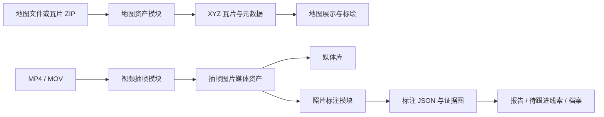

# 巡检宝可复用地图与媒体模块设计

**日期：** 2026-07-11
**状态：** 已确认，等待实施
**适用范围：** 巡检宝管理端、API、媒体处理服务及后续同类巡检项目

## 1. 目标

把已经在巡检宝中形成的三项能力沉淀为边界清晰、可单独安装和复用的内部模块：

1. 地图资产处理与展示；
2. 视频离线抽帧；
3. 照片标注编辑。

模块第一阶段保留在巡检宝 monorepo 中，以 workspace 包和独立服务形式复用；不立即发布公开 npm 包。每项能力都要有稳定的输入、输出和数据结构，后续项目可以替换页面外壳、复用业务能力。

导航术语同步调整：

- `审计` 改为 `操作日志`；
- `已发现问题` 改为 `待跟进线索`。

## 2. 总体边界



三个模块不直接依赖具体小区、道路或点位页面。关联对象、巡检任务、报告和线索由巡检宝业务层提供。

## 3. 复用方式

### 3.1 Workspace 包与服务

| 单元 | 位置 | 责任 | 不负责 |
| --- | --- | --- | --- |
| `@xunjianbao/map-core` | `packages/map-core` | 地图元数据、文件校验、瓦片清单、标绘几何协议 | 页面展示与用户权限 |
| `@xunjianbao/map-ui` | `packages/map-ui` | Leaflet 图层加载、标绘工具、区域与点位交互 | 上传、数据库和档案跳转策略 |
| `@xunjianbao/media-contracts` | `packages/media-contracts` | 视频、帧、处理任务和错误状态的类型及 DTO | 抽帧进程与界面 |
| `media-worker` | `services/media-worker` | 视频探测、抽帧、缩略图、任务重试与结果回写 | AI 识别与人工复核决策 |
| `@xunjianbao/annotation-editor` | `packages/annotation-editor` | 画布、标注工具、撤销重做、导入导出 | 报告提交和文件持久化 |

API 中现有的 `map-assets`、`reports`、`issues` 和媒体库页面只调用这些公开接口。其他项目可直接复用 workspace 包和 worker，再接入自己的对象档案体系。

### 3.2 统一数据原则

- 文件原件、派生文件和标注数据都保留可追溯父子关系；
- 前端坐标一律保存为 `0 ~ 1` 的相对坐标，图片尺寸变化不会导致标注偏移；
- 所有长耗时任务有状态、进度、失败原因和幂等键；
- 原文件不被转换结果覆盖；
- 模块不保留演示数据作为生产结果。

## 4. 地图资产模块

### 4.1 输入与输出

| 输入 | 输出 | 说明 |
| --- | --- | --- |
| PNG / JPG / WebP | 原图、预览图、元数据 | 适合普通二维底图 |
| TIF / TIFF / GeoTIFF | 原件、压缩 COG、XYZ 瓦片、边界元数据 | 适合正射影像与大范围地图 |
| XYZ 瓦片 ZIP | 解包后的 XYZ 瓦片、清单、边界元数据 | 复用现有上传发布流程 |

### 4.2 处理流程

1. 上传模块先校验扩展名、文件头、体积和空间参考信息。
2. 原始 TIF 永久保留，作为可追溯源文件。
3. 后台使用 GDAL 将 TIF 转为压缩 COG；默认采用无损或视觉无损压缩，按影像是否带透明通道决定 PNG 或 WebP 瓦片。
4. 后台生成 XYZ 瓦片和 `tile-metadata.json`，包含坐标边界、缩放范围、瓦片数量、压缩率和处理日志。
5. 发布时只切换活动地图版本；首页继续通过 `{z}/{x}/{y}` 按可视范围请求瓦片。
6. 地图标绘保存为独立几何记录，不随底图替换而丢失；切换底图后按边界坐标进行校验并提示无效标绘。

### 4.3 公开接口

- `MapAssetProcessor.process(upload, options)`：创建处理任务。
- `MapAssetProcessor.publish(assetId)`：切换活动地图版本。
- `MapTileSource.getTileUrl(assetId)`：提供 Leaflet XYZ 地址模板。
- `MapGeometryStore`：保存、更新和删除小区、道路、重点点位几何。

现有 `map-assets` API 与首页瓦片加载能力迁移到上述接口后保持兼容，避免改变现有上传的 ZIP 瓦片格式。

## 5. 视频离线抽帧模块

### 5.1 技术选择

采用服务器端 FFmpeg 直接处理视频，不在浏览器中抽帧。FFmpeg 负责视频探测、按时间间隔抽帧、缩略图生成和失败诊断；Node 服务只负责任务调度、文件关系和业务状态。该方式适合无人机 MP4/MOV 大文件，也能在腾讯云容器内独立扩缩容。

不在第一版接入 AI 识别。抽帧成功后生成的图片进入媒体库，供人工分拣、照片标注和后续 YOLO 服务消费。

### 5.2 任务状态

`queued`、`running`、`completed`、`failed`、`cancelled`。

每个任务记录：原始视频、抽帧间隔、总时长、已生成帧数、处理进度、开始/结束时间、失败原因和重试次数。

### 5.3 抽帧规则

- 默认每 3 秒一帧，任务可设为 2 至 5 秒；
- 帧文件命名包含视频 ID 与毫秒时间点；
- 每帧写入 `parentMediaId` 和 `videoTimestampMs`；
- 对同一视频、时间点和输出规格设置唯一约束，重试不重复产生帧；
- 生成中间缩略图用于媒体库卡片，原始视频保持不变。

### 5.4 服务协议

- `POST /media-jobs/frame-extraction`：创建抽帧任务。
- `GET /media-jobs/:id`：查询进度和错误。
- `POST /media-jobs/:id/retry`：重试失败任务。
- `GET /media-assets?parentMediaId=`：查询对应帧。

初期 worker 使用 PostgreSQL 任务表领取任务，以数据库事务保证单任务不被多个 worker 重复处理；后续高并发时可替换为 Redis/BullMQ，不改变 API 和数据契约。

## 6. 照片标注模块

### 6.1 产品能力

复用现有报告编写页已验证的矩形、箭头、文字、选择、移动、撤销、恢复和逐张图片说明能力，抽出为通用组件。

模块对外提供：

- 图片列表和当前图片切换；
- 矩形、箭头、文字标注；
- 拖动、缩放、删除、撤销和重做；
- 标注颜色、文字内容、层级和严重程度；
- `onChange(document)` 回调；
- 导入、导出、只读预览和证据图渲染。

### 6.2 标注文档格式

```ts
interface AnnotationDocument {
  version: 1;
  mediaId: string;
  imageWidth: number;
  imageHeight: number;
  annotations: Array<{
    id: string;
    type: "rect" | "arrow" | "text";
    x: number;
    y: number;
    width?: number;
    height?: number;
    points?: [number, number, number, number];
    text?: string;
    color: string;
    lineWidth: number;
    severity?: "low" | "medium" | "high";
    zIndex: number;
  }>;
}
```

`x`、`y`、`width`、`height` 与箭头点位均为相对坐标。报告、线索和事件只引用该文档，不复制一套私有标注格式。

### 6.3 画布内核

采用 `react-konva`/`konva` 作为标注画布内核。该库提供 React 组件化画布、图形事件、拖动、缩放和图层能力，适合照片标注这种高频交互场景。标注编辑器只在客户端加载，导出图片由后端渲染任务或浏览器导出完成。

## 7. 交付顺序与验收

### 阶段 A：术语与共享契约

- 修改导航显示名称为“操作日志”和“待跟进线索”。
- 新建 `@xunjianbao/media-contracts` 与基础 DTO。
- 验收：原有路由保持不变，导航链接和权限不回归。

### 阶段 B：地图资产模块化

- 迁移现有瓦片 ZIP 上传、发布、瓦片服务和标绘协议。
- 加入 TIF 转 COG/XYZ 的后台任务接口与处理记录。
- 验收：既有瓦片地图继续加载；同一 TIF 可生成并发布新版本；原图和处理产物均可追溯。

### 阶段 C：视频抽帧模块

- 新建 worker、任务表、FFmpeg 适配器与媒体库“创建抽帧任务”入口。
- 验收：MP4/MOV 可创建任务；每 2 至 5 秒生成帧；失败可读、可重试、不重复写帧。

### 阶段 D：照片标注模块

- 将报告编写页的标注能力迁移到独立包。
- 接入报告编辑和媒体库复核入口。
- 验收：原报告标注能力不退化；同一标注文档可在报告和线索页面只读或编辑展示。

每个阶段独立测试、独立提交并推送 Git；已验收阶段只通过公开接口被后续阶段使用。

## 8. 明确不做

- 不把大视频上传后交给浏览器抽帧；
- 不在本模块中实现实时 RTMP 识别或 YOLO 模型；
- 不把地图瓦片转换放在 Web 请求线程中；
- 不覆盖或删除上传的原始 TIF、视频和图片；
- 不把未来其他项目的对象模型写进通用包。

## 9. 风险与控制

- FFmpeg 与 GDAL 需要在 worker 镜像中显式安装，并记录版本和许可证；
- TIF 可能缺少地理参考，缺失时要求上传方填写边界坐标或使用图像坐标模式；
- 视频任务需要限制文件大小、并发数、最长时长和磁盘配额；
- 标注 JSON 必须做 DTO 校验，禁止任意 SVG/HTML 注入；
- 地图、视频和照片派生文件都通过统一存储接口，以便腾讯云 COS 替换本地磁盘。
